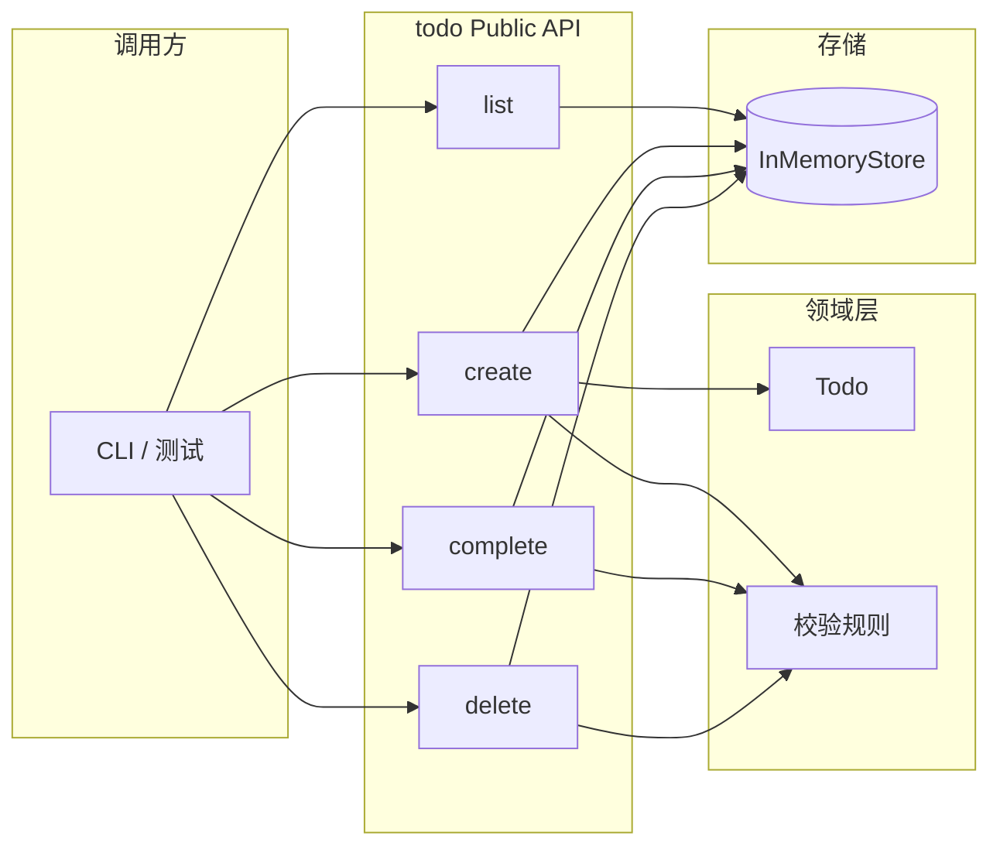
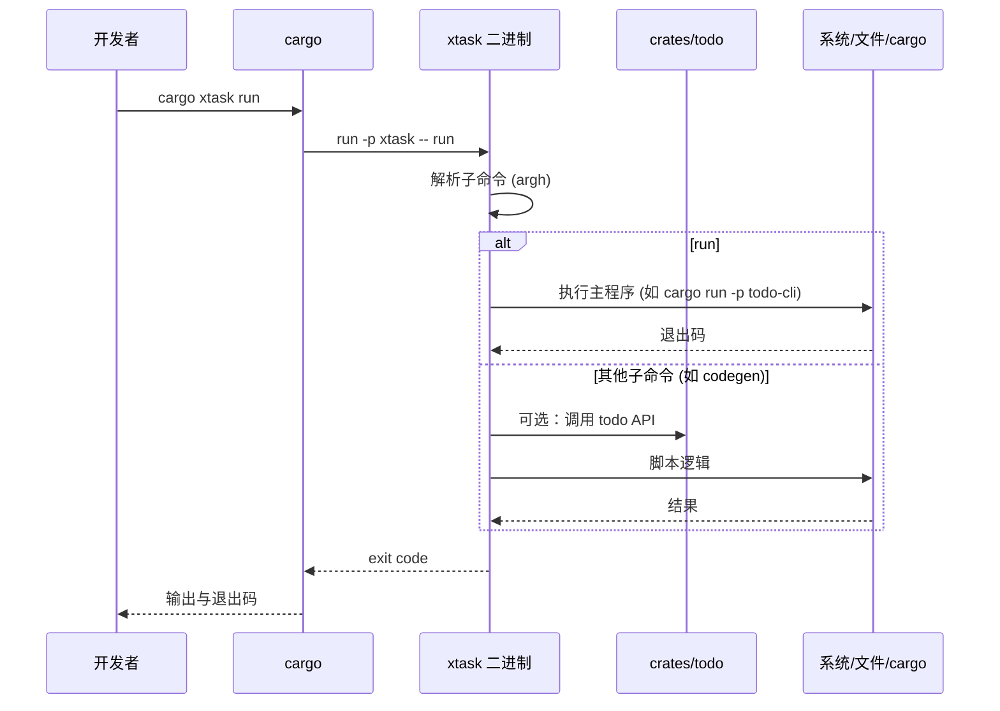

# 设计说明 (Design)

本文档描述 xtask_todo 的技术架构、数据流与接口设计，与 [requirements.md](./requirements.md) 中的用户故事与验收标准对应。

---

## 1. 技术架构

### 1.1 总体结构

项目为 Cargo workspace，根目录仅做工作区配置，业务与工具拆分到独立 crate：

```
┌─────────────────────────────────────────────────────────────────┐
│                     xtask_todo (workspace)                        │
├─────────────────────────────────────────────────────────────────┤
│  crates/todo          │  xtask                                   │
│  领域库 + 存储抽象     │  CLI 入口，调用 todo 或执行构建/脚本      │
└─────────────────────────────────────────────────────────────────┘
```

- **crates/todo**：待办领域逻辑与对外 API，不依赖 xtask。
- **xtask**：通过 `cargo xtask` 调用的二进制，封装「运行主程序、构建、发布」等脚本式任务，可依赖 `todo` 做集成或演示。

### 1.2 技术选型

| 层级       | 选型        | 说明 |
|------------|-------------|------|
| 语言       | Rust 2021   | 与 requirements 一致 |
| 工作区解析 | resolver = "2" | 统一依赖版本 |
| xtask CLI  | argh        | 子命令与参数解析，零配置 |
| 入口       | .cargo/config.toml alias | `cargo xtask` → `cargo run -p xtask --` |

### 1.3 Todo 库分层（crates/todo）

```
┌──────────────────────────────────────┐
│  Public API (调用方：CLI / 其他 crate) │
│  TodoList, create, list, complete, …  │
├──────────────────────────────────────┤
│  Domain (领域模型与规则)               │
│  Todo, TodoId, 状态、校验              │
├──────────────────────────────────────┤
│  Storage (存储抽象，可替换实现)         │
│  Store trait → InMemoryStore / 后续   │
└──────────────────────────────────────┘
```

- **Public API**：对外暴露的类型与函数，满足 requirements 中的创建/列表/完成/删除。
- **Domain**：待办实体、ID、状态及不依赖存储的校验（如标题非空）。
- **Storage**：以 trait 抽象「增删改查」，默认内存实现，便于测试与后续扩展持久化。

### 1.4 Xtask 角色

- 作为**单一入口**：`cargo xtask run`、`cargo xtask build` 等，不依赖系统 shell 或外部脚本。
- **不承载领域逻辑**：业务在 `todo` 中；xtask 只做编排（如调用 `todo` API、执行 `cargo build`、写文件等）。

---

## 2. 数据流

### 2.1 待办操作数据流（Todo 领域）

调用方（CLI 或测试）通过 todo 的 Public API 操作，API 使用领域模型并委托给 Store 实现。



- **创建**：输入标题 → 校验（非空等）→ 构造 `Todo` → 写入 Store → 返回 id。
- **列表**：无入参 → 从 Store 读取 → 按约定排序（如创建时间）→ 返回列表。
- **完成/删除**：输入 id → 校验存在性及权限 → 更新/移除 Store → 返回结果或错误。

### 2.2 Xtask 调用链

开发者执行 `cargo xtask <子命令>` 时，由 Cargo 根据 alias 调用 xtask 二进制，再按子命令分发。



- 所有「业务数据」都经由 `todo` 的 API；xtask 只做调用与进程/文件级操作。

### 2.3 状态与存储

- **crates/todo**：默认 `InMemoryStore`，进程内无持久化；可通过 `Store` 抽象扩展。
- **cargo xtask todo**：通过 xtask 将待办持久化到项目根目录的 **`.todo.json`**（JSON，含 id、title、completed、created_at_secs、completed_at_secs）；xtask 启动时加载、操作后写回，与 `TodoList` + `InMemoryStore::from_todos` 配合使用。

### 2.4 列表展示与时间

- **列表展示**（如 `cargo xtask todo list`）：每条展示创建时间（相对如「Xm/Xh/Xd ago」）；已完成项另展示完成时间与**用时**（完成时间 − 创建时间）。
- **长时间未完成提醒**：当输出为 TTY 时，创建超过约定阈值（默认 7 天）且未完成的任务以不同颜色（如 ANSI 黄色）展示；非 TTY 时不输出颜色码。

---

## 3. 接口

### 3.1 Todo 库公开 API（crates/todo）

以下为面向调用方的类型与函数级接口（具体签名以代码为准，此处约定语义与错误处理）。

#### 3.1.1 类型

| 类型        | 说明 |
|-------------|------|
| `TodoId`    | 待办唯一标识，对外不透明（如 `uuid` 或 `NonZeroU64`）。 |
| `Todo`      | 单条待办：`id`, `title`, `completed: bool`, `created_at`, `completed_at: Option<SystemTime>`（完成时间）。 |
| `TodoList`  | 门面：持有 Store，提供 `create` / `list` / `complete` / `delete`。 |

#### 3.1.2 行为接口（函数语义）

| 操作 | 签名语义 | 返回值 | 错误 |
|------|----------|--------|------|
| 创建 | `create(&mut self, title: impl AsRef<str>)` | `Result<TodoId, TodoError>` | 标题为空或违反校验规则 |
| 列表 | `list(&self) -> Vec<Todo>` 或 `list(&self, filter?)` | 按创建时间排序的列表 | - |
| 完成 | `complete(&mut self, id: TodoId)` | `Result<(), TodoError>` | id 不存在 |
| 删除 | `delete(&mut self, id: TodoId)` | `Result<(), TodoError>` | id 不存在（可选：幂等返回 Ok） |

#### 3.1.3 错误类型

- `TodoError`（或等价枚举）：至少包含 `InvalidInput`（如空标题）、`NotFound(TodoId)`，便于调用方与测试断言。

#### 3.1.4 存储抽象（内部接口）

- `Store` trait：提供 `insert`, `get`, `list`, `update`, `remove` 等，由 `InMemoryStore` 实现；后续可增加 `FileStore`、`SqlStore` 等而不改 Public API。

### 3.2 Xtask CLI 接口

| 子命令 | 说明 | 参数（当前/预留） |
|--------|------|-------------------|
| `run` | 运行主程序或默认「运行」行为 | 无 |
| `todo` | 待办管理（数据在 `.todo.json`） | 子命令见下 |
| （预留）`build` | 构建产物 | 可选 `--release` |
| （预留）`release` | 发布流程 | 可选版本/目标 |

**todo 子命令**：`cargo xtask todo add "标题"`、`cargo xtask todo list`、`cargo xtask todo complete <id>`、`cargo xtask todo delete <id>`。list 输出含创建/完成时间与用时；在 TTY 下对超过阈值未完成项着色。

- 入口：`cargo xtask [--] <子命令> [子命令参数]`。
- 帮助：`cargo xtask --help`、`cargo xtask <子命令> --help`。
- 退出码：成功 0，失败非 0；错误信息 stderr，正常输出 stdout。

### 3.3 与需求的对应关系

| 需求 | 设计对应 |
|------|----------|
| US-T1 创建待办 | `TodoList::create`，校验在 Domain，Store 持久化 |
| US-T2 列出待办 | `TodoList::list`，Store 提供列表并排序 |
| US-T3 完成待办 | `TodoList::complete`，Store 更新状态 |
| US-T4 删除待办 | `TodoList::delete`，Store 移除 |
| US-X1 通过 cargo xtask 执行 | .cargo/config.toml alias + xtask 二进制 |
| US-X2 xtask run | xtask 子命令 `run`，内部执行主程序 |
| US-X3 扩展子命令 | 在 xtask 中新增 argh 子命令与对应 handler |
| US-T5 时间戳与完成时间 | Todo 的 created_at / completed_at；list 展示创建/完成/用时 |
| US-T6 长时间未完成提醒 | list 在 TTY 下对超阈值未完成项着色 |
| US-X4 cargo xtask todo | xtask 子命令 todo add/list/complete/delete，.todo.json 持久化 |

---

## 4. 扩展与维护

- **新增 todo 能力**：在 Domain 与 Public API 增加方法或类型，必要时扩展 `Store` trait 与现有实现。
- **新增 xtask 子命令**：在 `xtask/src/main.rs` 中增加子命令枚举与实现，保持 `cargo xtask --help` 更新。
- **持久化**：新增实现 `Store` 的 crate，在构造 `TodoList` 时注入，不改变本文档中的 Public API 与数据流图。

文档与实现不一致时，以代码为准并同步更新本文档。
