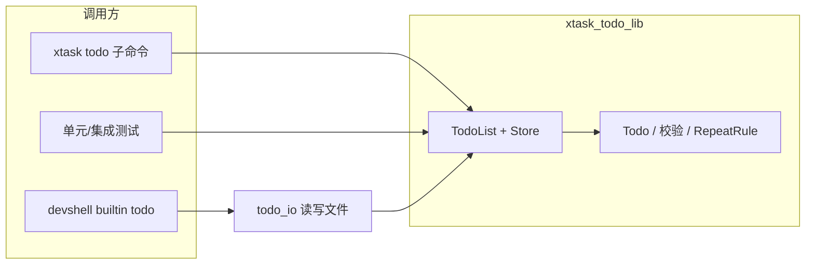
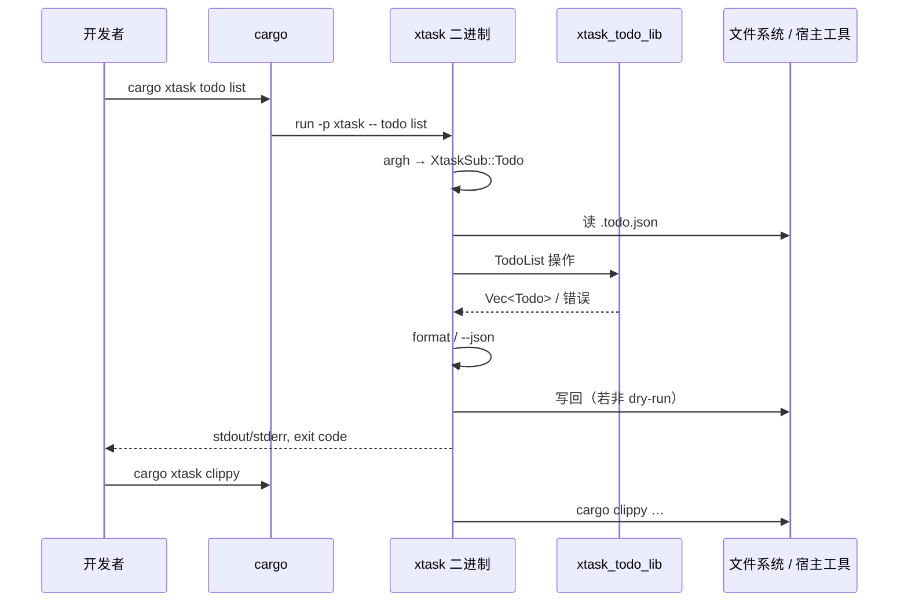
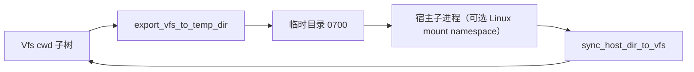

# 设计说明（Design）

本文档描述 xtask_todo 的**技术架构、模块划分与数据流**，与 [requirements.md](./requirements.md) 中的需求与验收对应。实现与文档不一致时，以代码为准并回写本文档。

---

## 1. 技术架构

### 1.1 总体结构

Cargo **workspace**（`resolver = "2"`）：根目录仅配置 members，业务在子 crate 中。

```
┌──────────────────────────────────────────────────────────────────────────┐
│                        xtask_todo (workspace)                             │
├──────────────────────────────────────────────────────────────────────────┤
│  crates/todo (xtask-todo-lib)     │  xtask                                │
│  · Todo 领域库                     │  · cargo xtask 唯一二进制入口         │
│  · devshell（VFS/脚本/REPL/沙箱/vm）│  · argh 解析，编排 todo 与宿主命令   │
│  · 二进制 cargo-devshell           │  · publish = false                    │
│  crates/devshell-vm（β 侧车 stub） │                                       │
└──────────────────────────────────────────────────────────────────────────┘
```

| Crate | 职责 |
|-------|------|
| **crates/todo** | 待办领域（`TodoList`、`Store`、`Todo`…）；**不依赖 xtask**。另含 **`devshell`** 子系统与 **`cargo-devshell`** 二进制。 |
| **crates/devshell-vm** | β 侧车占位二进制（`devshell-vm`）；IPC 见 `docs/superpowers/specs/2026-03-11-devshell-vm-ipc-draft.md`。 |
| **xtask** | `cargo xtask` 入口：`todo` 子命令走 `xtask_todo_lib`；其余子命令执行 fmt/clippy/git/gh 等。 |

### 1.2 技术选型

| 层级 | 选型 | 说明 |
|------|------|------|
| 语言 / Edition | Rust 2021 | 各 member 自管 `[lints.clippy]` |
| Workspace | `members = ["crates/todo", "crates/devshell-vm", "xtask"]` | 虚拟 workspace 不在根设 `[lints]` |
| xtask / todo CLI | **argh** | 子命令与 flag 解析 |
| devshell 行解析 | 自研 **parser** | 管道 `\|`、重定向 `<` `>` `2>`、引号等 |
| REPL | **rustyline** + 自定义 `Completer` | TTY 下 Tab 补全；`CompletionType::List` |
| 入口别名 | `.cargo/config.toml` | `cargo xtask` → `cargo run -p xtask --` |

### 1.3 Todo 库分层（`crates/todo` 领域部分）

```
┌─────────────────────────────────────────┐
│  Public API                              │
│  TodoList<S>, Todo, TodoId, TodoPatch,   │
│  ListOptions, RepeatRule, Store, …       │
├─────────────────────────────────────────┤
│  Domain                                  │
│  model, priority, repeat, id, error      │
├─────────────────────────────────────────┤
│  Storage                                 │
│  Store trait → InMemoryStore             │
└─────────────────────────────────────────┘
```

- **`TodoList<S: Store>`**：创建、列表（含 `list_with_options`）、`get`、`update`、`complete(id, no_next)`、`delete`、`search`、`stats`、`add_todo`（导入）等。
- **`InMemoryStore`**：进程内 Vec；**持久化**由 **xtask** 的 `todo/io` 将 `Vec<Todo>` ↔ `.todo.json` 完成，不在 Store 内嵌文件 I/O。

### 1.4 Devshell 分层（`crates/todo::devshell`）

与领域库并列，供 **REPL / 脚本 / 测试** 使用：

```
┌─────────────────────────────────────────────────────────────┐
│  cargo-devshell 二进制 → devshell::run_main / run_main_from_args │
├─────────────────────────────────────────────────────────────┤
│  repl          │  TTY: rustyline；非 TTY: read_line 循环      │
│  completion    │  DevShellHelper：命令名 + VFS 路径补全      │
│  parser        │  Pipeline / SimpleCommand / 重定向          │
│  command       │  dispatch / builtins / todo_builtin         │
│  vfs           │  内存树形 Vfs，Unix 风格路径                 │
│  script        │  .dsh：AST、exec、与 VFS 集成               │
│  sandbox       │  export VFS → temp → 跑 rustup/cargo → sync │
│  vm            │  可选会话后端：`SessionHolder`、workspace 同步（γ/β 见 spec） │
│  serialization │  Vfs ↔ .dev_shell.bin（或指定路径）          │
│  todo_io       │  devshell 内 `todo` 内置 ↔ .todo.json       │
└─────────────────────────────────────────────────────────────┘
```

- **不执行任意宿主 shell 命令**；除 **`rustup` / `cargo`** 经 **`SessionHolder`** 外，仅 **builtin**。
- **VM 模式（`cargo devshell` / 非 `cfg(test)` 库）**：见 `devshell::vm`。**Unix 默认**：未设置 **`DEVSHELL_VM`** 视为 **开启**；未设置 **`DEVSHELL_VM_BACKEND`** 默认为 **`lima`**（γ），即启动会话时即按 γ 解析 `limactl`（失败则 REPL/脚本入口报错）。**显式关闭 VM**：**`DEVSHELL_VM=off`**（或 `0`/`false`/`no`），或 **`DEVSHELL_VM_BACKEND=host`** / **`auto`** → 仅用宿主 temp + `sandbox::run_rust_tool`。**`cfg(test)`** 下库内默认仍为 **关 + `auto`**，保证无 Lima 时 **`cargo test`** 可通过。
  - **γ（Lima）**：**`DEVSHELL_VM_BACKEND=lima`**（Unix）通过 `limactl` 编排；无需额外 Cargo feature；挂载与工作区见 **`docs/devshell-vm-gamma.md`**。在宿主生成独立 **`todo`** 并写入 Lima 配置：**`cargo xtask lima-todo`**（合并 **`lima.yaml`** 与可选重启；**`xtask/src/lima_todo.rs`**）。若仓库位于 **`workspace_parent`** 挂载树内且已有 **`target/release/todo`**，**`exec limactl shell`** 时可自动注入 guest **`PATH`**（**`DEVSHELL_VM_AUTO_TODO_PATH`**，见 **`devshell/vm/session_gamma/helpers.rs`**）。
  - **β（IPC 桩）**：**`DEVSHELL_VM_BACKEND=beta`** 仅在 **Unix** 且编译时启用 Cargo feature **`beta-vm`** 时可用；侧车经 **`DEVSHELL_VM_SOCKET`**（库内常量 `ENV_DEVSHELL_VM_SOCKET`）连接 **`devshell-vm --serve-socket`**。行为与联调步骤同 **`docs/devshell-vm-gamma.md`** §「β 桩」及 IPC 草案 `docs/superpowers/specs/2026-03-11-devshell-vm-ipc-draft.md`。
  - **γ 诊断**：**`DEVSHELL_VM_LIMA_HINTS`**（默认开）在首次 VM 内工具调用前及 **`cargo`/`rustup` 失败** / **`limactl start` 失败** 时，对 **`lima.yaml` 挂载、`/workspace`、guest **`cargo`**、`ha.stderr.log` 中的 KVM 提示等做启发式检测并 **`eprintln!` 建议**；常量 **`ENV_DEVSHELL_VM_LIMA_HINTS`**。
  - 规格与计划：`docs/superpowers/specs/2026-03-11-devshell-microvm-session-design.md`、`docs/superpowers/plans/2026-03-11-devshell-microvm-session.md`。
  - **架构演进（已选型，未实现）**：**以 guest 文件系统为唯一真源（Mode P）**——REPL/脚本与 `cargo` 共用 VM 内挂载目录，取消工程树在内存 VFS 与 guest 之间的 push/pull 对齐；总览 **`docs/superpowers/specs/2026-03-20-devshell-vm-primary-guest-filesystem.md`**，**详细设计（头脑风暴）** **`docs/superpowers/specs/2026-03-20-devshell-guest-primary-design.md`**。Mode P 下会话持久化 **不沿用** 现行 **`.dev_shell.bin`** 文件格式，改用与虚拟工作区 / guest 一致的新载体（见该文 **§10**）；**`todo` / `.todo.json`** 仍只在 **宿主**（`todo_io` 约定，该文 **§11 A**）。**`DEVSHELL_VM_WORKSPACE_MODE=guest`** 与 **`DEVSHELL_VM=off`** 或 **`DEVSHELL_VM_BACKEND=host`/`auto`** 同时出现时 **强制按 Mode S（sync）** 运行、**不报错**（该文 **§6**）。在对应代码与开关落地前，**默认仍为内存 VFS + 同步（Mode S）**。
- **管道**：前一阶段 stdout 写入缓冲，作为下一阶段 stdin；**重定向** 在 builtin 层用 VFS 读写字节。

### 1.5 Xtask 角色

- **编排与 CLI**：解析参数、加载/保存 `.todo.json`、调用 `xtask_todo_lib::TodoList`、格式化输出、JSON/dry-run/退出码。
- **工具子命令**：fmt、clippy、coverage、clean、run、gh、git、publish 等——**不内嵌 Todo 领域规则**。
- **入口**：`xtask/src/main.rs` → `xtask::run()` → `run_with(XtaskCmd)`（逻辑在 **`lib.rs`**，便于测试）。

---

## 2. 数据流

### 2.1 Todo 领域数据流



- **xtask**：`todo/io` 读 `.todo.json` → 构造 `TodoList<InMemoryStore>` → 执行子命令 → 写回文件（`--dry-run` 跳过写）。
- **devshell**：`todo_io` 在 **当前工作目录约定** 下读写 **同一 `.todo.json`**；内置 `todo` 为 **子集**（无 export/import/init-ai），参数为「字符串切片」风格，与 argh 的 xtask 层分离。

### 2.2 `cargo xtask` 调用链



- **退出码**：`RunFailure.code`；仅 **todo** 子命令细分为 **2（参数）/ 3（数据）**；其余失败多为 **1**。

### 2.3 持久化与序列化

| 数据 | 位置 | 说明 |
|------|------|------|
| 待办列表 | **`.todo.json`** | xtask `todo/io`：JSON 数组；字段含 id、title、completed、时间戳（秒）、可选 description/due_date/priority/tags/repeat_*。 |
| Devshell 工作区 | **`.dev_shell.bin`**（可 `cargo-devshell <path>` 指定） | **Mode S**：`devshell::serialization` 与内存 `Vfs` 双向序列化；REPL 退出或脚本结束保存。**Mode P（guest-primary）**：**不**写入 legacy bin；元数据写入 **`{stem}.session.json`**（如 `.dev_shell.session.json`），见 **`devshell::session_store`** 与 **`docs/superpowers/specs/2026-03-20-devshell-guest-primary-design.md` §10**。 |

**宿主文本编码（尤其 Windows）**：**`devshell::host_text`** 用于从磁盘读入 **`.dsh`**、`source` / `.` 目标、脚本内 **`source`**，以及 **`todo_io::load_todos` 的 `.todo.json`**。支持 **UTF-8（可选 BOM）**、**UTF-16 LE/BE（带 BOM）**，避免记事本等以「Unicode」/「UTF-8」保存时仅用 `read_to_string` 导致的乱码或解析失败。Rust 沙箱的 **`copy_tree_to_host` / `sync_host_dir_to_vfs`** 仍为**按字节**读写，不经文本解码。

### 2.4 列表展示与时间（xtask）

- **`xtask/src/todo/format.rs`**：`print_todo_list_items`，TTY 检测后决定是否着色；**7 天**未完成的开放任务 **ANSI 黄色**（`AGE_THRESHOLD_DAYS`）。
- 人类可读：**相对时间** + 已完成项 **用时**（完成时间 − 创建时间）。

### 2.5 Rust 工具链沙箱（devshell）



- **`sandbox` 模块**：`export_vfs_to_temp_dir` → **`host_export_root`** 与 `copy_tree_to_host` 布局一致（导出节点名为宿主子目录，如 `/projects/hello` → `…/hello`）→ **Unix**：在运行 `cargo`/`rustup` 前对 **`target/` 下 ELF 魔数文件 `chmod 0755`**（VFS 经 `write` 导出会丢失执行位，否则 `cargo run` 可能跳过重建并 **exec 失败 EACCES**）→ **`find_in_path` + `run_in_export_dir`**（宿主 `PATH` 中的 `cargo`/`rustup`，**不**调用 Podman/Docker）→ `sync_host_dir_to_vfs` → 删除临时目录。导出父目录默认 **`XDG_CACHE_HOME`/cargo-devshell-exports** 或 **`HOME`/.cache/cargo-devshell-exports**（Windows：`LOCALAPPDATA`/cargo-devshell-exports），避免部分系统上 **`/tmp` 的 `noexec`** 导致 `cargo run` 能编译却无法执行 `target/debug/*`（EACCES）。可用环境变量 **`DEVSHELL_EXPORT_BASE`** 覆盖。Linux 上可选 **`DEVSHELL_RUST_MOUNT_NAMESPACE`**：`unshare(CLONE_NEWNS)` + `MS_REC|MS_PRIVATE`（libc，非容器引擎）。
- **错误**：未找到 `cargo`/`rustup` → `RustupNotFound` / `CargoNotFound`；导出/同步失败见 `SandboxError`。
- 详见 [dev-container.md](./dev-container.md)。

---

## 3. 接口与模块映射

### 3.1 Todo 库公开类型（摘要）

| 类型 | 说明 |
|------|------|
| `TodoId` | `NonZeroU64` 封装，0 非法。 |
| `Todo` | 含 `created_at` / `completed_at`、`description`、`due_date`、`priority`、`tags`、`repeat_rule`、`repeat_until`、`repeat_count`。 |
| `TodoPatch` | 部分更新；`repeat_rule_clear` 清除重复规则。 |
| `ListOptions` / `ListFilter` / `ListSort` | 列表过滤与排序。 |
| `TodoList<S: Store>` | 领域操作门面。 |
| `Store` / `InMemoryStore` | 存储抽象与默认实现。 |
| `TodoError` | `InvalidInput`、`NotFound` 等。 |

具体签名以 **`crates/todo/src/list/mod.rs`** 与 **`model.rs`** 为准。

### 3.2 Xtask 子命令（`xtask/src/lib.rs`）

| `XtaskSub` | 职责 |
|------------|------|
| `Run` | 运行约定主程序/示例。 |
| `Clean` | 清理构建产物。 |
| `Clippy` | Clippy（项目策略见 crate lints）。 |
| `Coverage` | tarpaulin 等覆盖率任务。 |
| `Fmt` | `cargo fmt`。 |
| `Gh` | 封装 GitHub CLI（如 `gh log`）。 |
| `Git` | add / pre-commit / commit 等。 |
| `Publish` | 发布辅助（见 `docs/publishing.md`）。 |
| `Todo` | 见下表。 |

**`todo` 子命令**由 **`xtask/src/todo/cmd/dispatch.rs`** 分发，参数类型在 **`args.rs`**（`TodoAddArgs`、`TodoListArgs`…），错误在 **`error.rs`**（映射退出码）。

### 3.3 Devshell 对外入口

| 函数 | 用途 |
|------|------|
| `devshell::run_main()` | 二进制入口：读 `env::args()`、TTY 检测、stdin/out/err。 |
| `devshell::run_main_from_args(...)` | 测试与嵌入：`-f` 脚本、`-e`、`[path]`。 |
| `devshell::run_with(...)` | 简化测试路径（非完整 CLI）。 |

**内置命令**实现在 **`command/dispatch.rs`**（`execute_pipeline`、`run_builtin`），**`todo`** 在 **`command/todo_builtin.rs`**。

### 3.4 与需求的对应关系（扩展）

| 需求 | 设计落点 |
|------|----------|
| US-T1～T6 | `TodoList`、`Store`、`format.rs` |
| US-T7～T12 | `list/get/update/search/stats`、xtask `dispatch` + import/export |
| US-T13 | `repeat.rs` + `complete(..., no_next)` |
| US-A1～A4 | xtask `todo` 全局 flag、`print_json_error`、`TodoCliError` 退出码 |
| US-X1～X3 | `lib.rs` `XtaskCmd`、argh 子命令枚举 |
| US-X4 | `todo/io` + `.todo.json` |
| devshell（requirements §6） | `devshell::*` 模块树、`sandbox`、`completion`、`repl` |

---

## 4. 关键设计决策

### 4.1 持久化与领域分离

- **文件 I/O 留在 xtask（及 devshell `todo_io`）**，库侧保持 **`TodoList` + `InMemoryStore`**，便于测试与替换存储，避免 lib 绑定单一路径策略。

### 4.2 Devshell 与 xtask 不互相依赖

- **xtask** 依赖 **xtask-todo-lib** 仅用于 **Todo 领域**。
- **devshell** 在 **同一 lib crate** 中，但 **xtask 二进制不包含 REPL**；用户通过 **`cargo run -p xtask-todo-lib --bin cargo-devshell`** 使用。

### 4.3 Tab 补全

- **`CompletionType::List`**：行为接近 bash（最长公共前缀 + 多义二次 Tab），避免 Circular 在单候选下「还原到补全前」的意外。
- **路径候选**：`complete_path` 返回 **含目录前缀的整词**（如 `src/main.rs`），与 rustyline 按 `start..pos` 整段替换一致。

### 4.4 脚本与 REPL 变量作用域

- **脚本文件**内变量与控制流 **独立于下一条 REPL 行**（requirements 已说明）；实现上每脚本/每次 `source` 使用脚本执行器的栈帧，不污染全局 REPL 会话（以实现为准）。

---

## 5. 扩展与维护

- **新增 Todo 能力**：改 `model` / `list` / `store`（若需）；同步 xtask `args` + `dispatch` + JSON 形状；更新 **requirements.md** 与本文档。
- **新增 xtask 子命令**：在 **`XtaskSub`** 增加变体并在 **`run_with`** 分支调用；保持 `--help` 可读。
- **新增 devshell builtin**：`command/dispatch.rs` 注册 + `completion::BUILTIN_COMMANDS` + 帮助文案。
- **Rust 沙箱增强**：见 `docs/superpowers/specs/` 下 Rust VM 设计/计划；实现落在 **`sandbox.rs`**。

---

## 6. 参考文档

- [requirements.md](./requirements.md) — 功能需求与验收。
- [publishing.md](./publishing.md) — crates.io 发布范围（仅 **xtask-todo-lib**）。
- `docs/superpowers/specs/` — devshell 脚本、gh log、Rust 沙箱等专题设计与计划。
