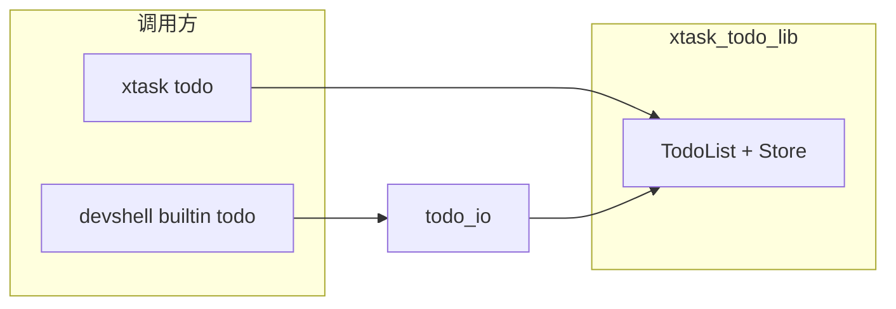
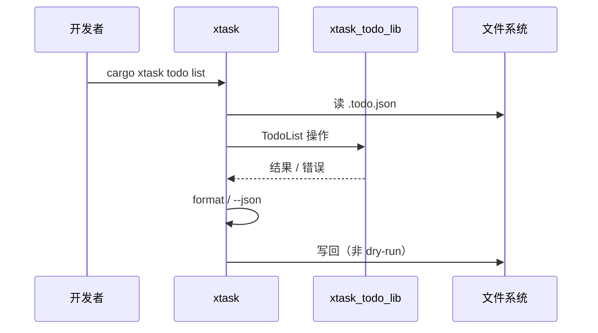
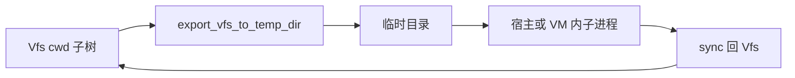

# 设计说明（Design）

本文档描述 **xtask_todo** 的技术架构、模块划分与数据流，与 [requirements.md](./requirements.md) 对齐。实现与文档不一致时，以代码为准并回写本文档。

---

## 1. 技术架构

### 1.1 总体结构

Cargo **workspace**（`resolver = "2"`）：根目录配置 members，业务在子 crate 中。

```
┌──────────────────────────────────────────────────────────────────────────┐
│                        xtask_todo (workspace)                             │
├──────────────────────────────────────────────────────────────────────────┤
│  crates/todo (xtask-todo-lib)     │  xtask                                │
│  · Todo 领域库                     │  · cargo xtask 唯一二进制入口         │
│  · devshell（VFS/脚本/REPL/沙箱/vm）│  · argh 解析，编排 todo 与宿主命令   │
│  · 二进制 cargo-devshell           │  · publish = false                    │
│  crates/devshell-vm（β 侧车）      │                                       │
└──────────────────────────────────────────────────────────────────────────┘
```

| Crate | 职责 |
|-------|------|
| **crates/todo** | 待办领域（`TodoList`、`Store`、`Todo`…）；**不依赖 xtask**。含 **`devshell`** 与 **`cargo-devshell`**。 |
| **crates/devshell-vm** | β 侧车二进制（`devshell-vm`）；IPC 见 `docs/superpowers/specs/2026-03-11-devshell-vm-ipc-draft.md`。 |
| **xtask** | `cargo xtask`：`todo` 走 `xtask_todo_lib`；其余为 fmt/clippy/git/gh 等。 |

### 1.2 技术选型

| 层级 | 选型 | 说明 |
|------|------|------|
| 语言 / Edition | Rust 2021 | 各 member 自管 `[lints.clippy]` |
| Workspace | `members = ["crates/todo", "crates/devshell-vm", "xtask"]` | 根不设 `[lints]` |
| xtask / todo CLI | **argh** | 子命令与 flag |
| devshell 行解析 | 自研 **parser** | 管道 `\|`、重定向、引号 |
| REPL | **rustyline** + 自定义 `Completer` | **`CompletionType::List`** |
| 入口别名 | `.cargo/config.toml` | `cargo xtask` → `cargo run -p xtask --` |

### 1.3 Todo 库分层（`crates/todo` 领域部分）

```
┌─────────────────────────────────────────┐
│  Public API                              │
│  TodoList<S>, Todo, TodoId, TodoPatch,   │
│  ListOptions, RepeatRule, Store, …       │
├─────────────────────────────────────────┤
│  Domain                                  │
│  model, priority, repeat, id, error      │
├─────────────────────────────────────────┤
│  Storage                                 │
│  Store trait → InMemoryStore             │
└─────────────────────────────────────────┘
```

- **`TodoList<S: Store>`**：创建、列表、`get`、`update`、`complete(id, no_next)`、`delete`、`search`、`stats`、导入等。
- **`InMemoryStore`**：进程内 Vec；**`.todo.json`** 由 **xtask** `todo/io` 与 devshell **`todo_io`** 在 crate 外完成读写。

### 1.4 Devshell 分层（`crates/todo::devshell`）

```
┌─────────────────────────────────────────────────────────────┐
│  cargo-devshell → devshell::run_main / run_main_from_args    │
├─────────────────────────────────────────────────────────────┤
│  repl          │  TTY: rustyline；非 TTY: read_line           │
│  completion    │  命令名 + VFS 路径补全                        │
│  parser        │  Pipeline / SimpleCommand / 重定向          │
│  command       │  dispatch / builtins / todo_builtin         │
│  vfs           │  内存 Vfs（Mode S 真源；Mode P 为辅助视图）   │
│  script        │  .dsh：AST、exec                              │
│  sandbox       │  export VFS → temp → rustup/cargo → sync    │
│  vm            │  SessionHolder、γ Lima / β IPC、workspace 同步│
│  session_store │  会话 JSON（路径约定见 requirements §1.1）   │
│  serialization │  Vfs 快照序列化（测试/Mode S 等；实现细节）  │
│  todo_io       │  devshell 内 `todo` ↔ `.todo.json`           │
└─────────────────────────────────────────────────────────────┘
```

**执行模型**：不执行任意宿主 shell；除 **`rustup`/`cargo`** 经 **`SessionHolder`** 外，仅 **builtin**。

**VM（`devshell::vm`）**

- **Unix 默认**：未设 **`DEVSHELL_VM`** 视为开启；未设 **`DEVSHELL_VM_BACKEND`** 默认为 **`lima`**（γ）。**关闭**：**`DEVSHELL_VM=off`** 或 **`DEVSHELL_VM_BACKEND=host`** / **`auto`**。
- **γ**：`limactl` 编排；挂载与工作区见 **`docs/devshell-vm-gamma.md`**；**`cargo xtask lima-todo`** 维护 **`lima.yaml`**。
- **β**：**`--features beta-vm`**，**`DEVSHELL_VM_SOCKET`** 连接 **`devshell-vm --serve-socket`**；见 **`docs/devshell-vm-gamma.md`**。
- **Mode S / Mode P**：见 **requirements §1.1** 与 **`docs/superpowers/specs/2026-03-20-devshell-guest-primary-design.md`**。Mode P 下工程树经 **`GuestFsOps`** 与 guest 挂载一致；**`DEVSHELL_VM_WORKSPACE_MODE=guest`** 与 **`DEVSHELL_VM=off`** 等冲突时 **降级 Mode S**（不报错）。
- **会话持久化**：**`logical_cwd`** 等写入 **工作区树内** JSON（**requirements §1.1** 路径）；不以「宿主进程 cwd 旁的 `*.session.json`」为规范。

**管道 / 重定向**：前段 stdout → 缓冲 → 下段 stdin；重定向在 builtin 层走 VFS 或 guest 路径（以实现为准）。

### 1.5 Xtask 角色

- **todo 子命令**：加载/保存 **`.todo.json`**、调用 **`TodoList`**、人类可读 / `--json`、`--dry-run`、退出码。
- **其他子命令**：fmt、clippy、coverage、git、gh、publish 等——**不内嵌 Todo 领域规则**。
- **入口**：`xtask/src/main.rs` → **`xtask::run()`**（**`lib.rs`** 便于测试）。

---

## 2. 数据流

### 2.1 Todo 领域



- **xtask**：`todo/io` ↔ **`.todo.json`** ↔ `TodoList`；**`--dry-run`** 跳过写。
- **devshell**：**`todo_io`** 在 cwd 约定下读写 **同一 `.todo.json`**；内置 **`todo`** 为子集（无 export/import/init-ai）。

### 2.2 `cargo xtask` 调用链



- **退出码**：todo 子命令 **2** 参数错误、**3** 数据错误；其余失败多为 **1**。

### 2.3 持久化

| 数据 | 位置 | 说明 |
|------|------|------|
| 待办列表 | **`.todo.json`** | JSON 数组；id、title、completed、时间戳、可选字段。 |
| Devshell 会话 | **工作区内** **`…/.cargo-devshell/session.json`** | 与 **requirements §1.1** 一致；宿主侧与 **`DEVSHELL_WORKSPACE_ROOT`** 挂载对齐。 |
| Vfs 快照 | 实现内序列化 | Mode S 等路径；**非**对外规范文件名（见 **requirements**）。 |

**宿主文本编码**：**`devshell::host_text`** 用于 **`.dsh`**、`source`、**`.todo.json`**（UTF-8/UTF-16 BOM）。沙箱 **copy/sync** 仍为按字节。

### 2.4 列表展示与时间（xtask）

- **`xtask/src/todo/format.rs`**：TTY 着色；**7 天**未完成 **ANSI 黄色**（**`AGE_THRESHOLD_DAYS`**）。
- 人类可读：相对时间、已完成项用时。

### 2.5 Rust 工具链沙箱（devshell）



- **`sandbox`**：`export_vfs_to_temp_dir` → **`run_in_export_dir`**（PATH 中 **`cargo`/`rustup`**）→ **`sync_host_dir_to_vfs`**。导出基目录 **`DEVSHELL_EXPORT_BASE`** / 默认 cache 路径；Linux 可选 **`DEVSHELL_RUST_MOUNT_NAMESPACE`**。详见 **[dev-container.md](./dev-container.md)**。

---

## 3. 接口与模块映射

### 3.1 Todo 库（摘要）

| 类型 | 说明 |
|------|------|
| `TodoId` | `NonZeroU64`，0 非法。 |
| `Todo` / `TodoPatch` / `ListOptions` | 见 **`crates/todo/src/list/`**、**`model.rs`**。 |
| `TodoList<S: Store>` / `InMemoryStore` | 领域门面与默认存储。 |

### 3.2 Xtask（`xtask/src/lib.rs`）

| `XtaskSub` | 职责 |
|------------|------|
| `Run` / `Clean` / `Clippy` / `Coverage` / `Fmt` / `Gh` / `Git` / `Publish` | 开发者任务。 |
| `Todo` | **`todo/cmd/dispatch.rs`** + **`args.rs`** + **`error.rs`**。 |

### 3.3 Devshell 入口

| 函数 | 用途 |
|------|------|
| **`run_main` / `run_main_from_args` / `run_with`** | 二进制与测试入口。 |

**Builtin**：**`command/dispatch.rs`**；**`todo`**：**`command/todo_builtin.rs`**。

### 3.4 与 requirements 章节的对应

| requirements | 设计落点 |
|--------------|----------|
| §3 Todo | `TodoList`、`Store`、`xtask/todo/*`、`format.rs` |
| §4 其他 xtask | **`XtaskSub`**、`run_with` |
| §5 Devshell | **`devshell::*`**、`sandbox`、`vm`、`session_store`、`completion`、`repl` |
| §6 AI / 退出码 | **`--json`**、**`TodoCliError`**、**`print_json_error`** |
| §7 非功能 | Clippy、stderr、TTY 颜色 |

---

## 4. 关键设计决策

### 4.1 持久化与领域分离

- **`.todo.json`** I/O 在 **xtask** 与 **devshell `todo_io`**；库保持 **`InMemoryStore`**。

### 4.2 Devshell 与 xtask 分离

- **xtask** 依赖 **xtask-todo-lib** 仅用于 **Todo**；**REPL** 通过 **`cargo-devshell`** 二进制。

### 4.3 Tab 补全

- **`CompletionType::List`**；路径候选为**含目录前缀的整词**。

### 4.4 脚本与 REPL

- 脚本 / `source` 作用域不污染后续 REPL 行（以实现为准）。

---

## 5. 扩展与维护

- 新 Todo 能力：领域 + xtask `args`/`dispatch` + **requirements.md**。
- 新 xtask 子命令：**`XtaskSub`** + **`run_with`**。
- 新 devshell builtin：**`dispatch.rs`** + **`BUILTIN_COMMANDS`** + 帮助文案。
- VM / 沙箱：见 **`docs/superpowers/specs/`**、**`sandbox.rs`**。

---

## 6. 参考

- [requirements.md](./requirements.md)（**§9** 含章节索引表，便于与旧文档章节号区分）
- [publishing.md](./publishing.md)
- [devshell-vm-gamma.md](./devshell-vm-gamma.md)
- `docs/superpowers/specs/` — 专题设计
