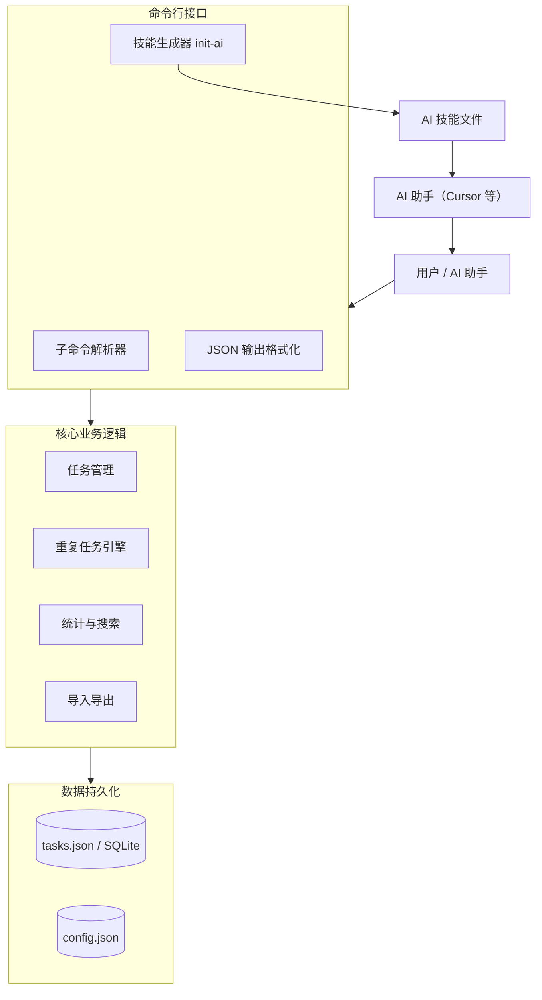
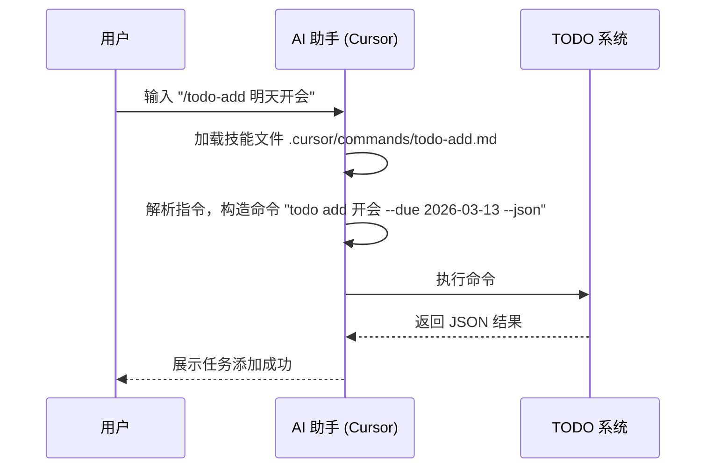
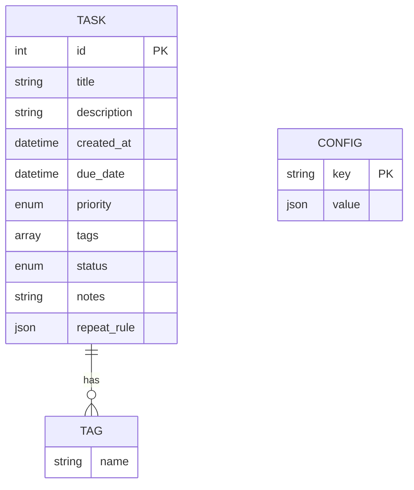

## 命令行 TODO 系统需求文档（AI 技能集成版）

> **说明**：仓库内**正式需求**以根目录 **[requirements.md](../requirements.md)** 为准；本文为历史/示例草稿，仅作结构参考。

### 文档信息

| 项目 | 内容 |
|------|------|
| 文档名称 | 命令行 TODO 系统需求文档 |
| 版本 | 1.0 |
| 最后更新 | 2026-03-12 |
| 状态 | 草案 |

---

### 1. 引言

#### 1.1 项目背景
在人工智能快速发展的今天，开发者越来越依赖 AI 助手（如 Cursor、GitHub Copilot、Claude Code 等）来提升工作效率。然而，传统的命令行工具与 AI 助手的集成方式往往简单粗暴，AI 只能通过生成原始命令来调用，缺乏结构化的交互和上下文感知能力。本项目旨在开发一个**具备 AI 技能集成能力的命令行 TODO 系统**，它不仅是一个功能完善的任务管理工具，更重要的是能够**主动适配主流 AI 助手**，让 AI 通过自然语言或斜杠命令（如 `/todo-add`）智能地操作 TODO 系统，实现“规范驱动”的协作模式。

#### 1.2 项目目标
- 提供一个功能完备的命令行 TODO 系统，支持任务的增删改查、重复任务、标签、优先级等特性。
- 设计一套**标准化的命令行接口**，确保输出格式机器可读（JSON），便于 AI 解析。
- 实现 **`todo init-ai` 命令**，能够为目标 AI 助手（Cursor、Claude Code、Windsurf 等）生成专属的“技能文件”，使 AI 学会使用 TODO 工具。
- 保持工具轻量、跨平台、易于扩展。

#### 1.3 目标用户
- **终端用户**：希望通过命令行高效管理个人任务的开发者或普通用户。
- **AI 助手**：作为工具的“智能代理”，通过技能文件理解工具用法，并代表用户执行操作。

---

### 2. 总体架构

下图展示了系统的总体架构，包括用户/AI 交互层、命令行接口层、核心业务逻辑层和数据持久化层。



---

### 3. 功能需求

#### 3.1 任务管理核心功能

| 编号 | 需求名称 | 描述 | 优先级 |
|------|----------|------|--------|
| F1.1 | 添加任务 | 用户可通过 `todo add <title>` 添加任务，支持描述、截止日期、优先级、标签等可选属性。 | P0 |
| F1.2 | 查看任务列表 | 通过 `todo list` 查看任务，支持按状态、优先级、标签、截止日期过滤，支持排序。 | P0 |
| F1.3 | 查看任务详情 | `todo show <id>` 展示单个任务的完整信息。 | P1 |
| F1.4 | 更新任务 | `todo update <id>` 修改任务的任意属性。 | P0 |
| F1.5 | 删除任务 | `todo delete <id>` 删除指定任务，支持 `--force` 跳过确认。 | P0 |
| F1.6 | 标记完成 | `todo done <id>` 将任务状态设为“已完成”；对重复任务可自动生成下一次实例。 | P0 |
| F1.7 | 任务属性 | 任务应包含：ID、标题、描述、创建时间、截止日期、优先级（高/中/低）、标签列表、状态（待办/进行中/已完成）、备注、重复规则（可选）。 | P0 |

#### 3.2 重复任务功能

| 编号 | 需求名称 | 描述 | 优先级 |
|------|----------|------|--------|
| F2.1 | 定义重复规则 | 支持 `daily`、`weekly`、`monthly`、`yearly`、`weekdays` 以及自定义间隔（如 `2d`、`3w`），可附加结束条件（次数或日期）。 | P1 |
| F2.2 | 自动生成新实例 | 当重复任务被标记为完成时，系统根据规则自动创建下一个任务，截止日期自动计算。 | P1 |
| F2.3 | 跳过下次生成 | 标记完成时可使用 `--no-next` 选项，不生成下一次任务。 | P2 |
| F2.4 | 重复规则查看/修改 | 在任务详情中展示重复规则，支持修改或取消。 | P1 |

#### 3.3 高级功能

| 编号 | 需求名称 | 描述 | 优先级 |
|------|----------|------|--------|
| F3.1 | 搜索任务 | `todo search <keyword>` 在标题、描述、标签中搜索。 | P1 |
| F3.2 | 统计信息 | `todo stats` 显示任务总数、已完成数、未完成数等。 | P2 |
| F3.3 | 导入导出 | 支持将任务导出为 JSON/CSV 文件，或从文件导入。 | P2 |
| F3.4 | 数据备份 | 自动备份数据文件（可选）。 | P3 |

#### 3.4 AI 集成功能

| 编号 | 需求名称 | 描述 | 优先级 |
|------|----------|------|--------|
| F4.1 | 标准化输出格式 | 所有命令支持 `--json` 选项，输出结构化数据，包含操作结果、错误信息等。 | P0 |
| F4.2 | 合理的退出码 | 命令执行后返回标准退出码（0成功，1一般错误，2参数错误，3数据错误）。 | P1 |
| F4.3 | 技能生成命令 | `todo init-ai` 命令可为指定 AI 助手生成技能文件。 | P0 |
| F4.4 | 多 AI 工具适配 | 支持为 Cursor、Claude Code、Windsurf、GitHub Copilot 等主流 AI 工具生成对应格式的技能文件。 | P1 |
| F4.5 | 技能文件内容 | 每个技能文件应包含元数据（名称、描述）和详细的自然语言指令，指导 AI 如何解析用户意图并构造命令。 | P0 |
| F4.6 | 技能自动加载 | 生成的技能文件应放置在 AI 助手默认的指令目录（如 `.cursor/commands/`），以便助手启动时自动加载。 | P1 |
| F4.7 | 模拟执行 | 支持 `--dry-run` 选项，仅显示将要执行的命令而不实际修改数据，便于 AI 预览。 | P2 |

---

### 4. 非功能需求

| 编号 | 需求名称 | 描述 | 优先级 |
|------|----------|------|--------|
| NF1 | 响应性能 | 所有命令响应时间应在毫秒级，支持数千条任务不显著降级。 | P0 |
| NF2 | 跨平台支持 | 支持 Linux、macOS、Windows（通过兼容的终端和路径处理）。 | P0 |
| NF3 | 命令稳定性 | 主版本内命令语法保持向后兼容，变更前需提前废弃警告。 | P1 |
| NF4 | 可测试性 | 核心逻辑应单元测试覆盖，模拟模式便于 AI 安全验证。 | P1 |
| NF5 | 安全性 | 数据文件权限应设置为仅用户可读写；命令注入风险需通过严格参数解析防范。 | P1 |
| NF6 | 文档完整性 | 提供详细的命令参考文档（Markdown 格式），包含示例和 JSON 输出说明。 | P0 |

---

### 5. 命令行接口设计

#### 5.1 全局选项

| 选项 | 描述 |
|------|------|
| `--help` | 显示帮助信息 |
| `--version` | 显示版本号 |
| `--json` | 以 JSON 格式输出结果（所有子命令支持） |
| `--dry-run` | 模拟执行，不实际修改数据（适用于修改类命令） |

#### 5.2 子命令列表

| 命令 | 功能 | 主要选项 |
|------|------|----------|
| `todo add <title>` | 添加任务 | `-d, --desc <text>`<br>`--due <date>`<br>`-p, --priority <level>`<br>`-t, --tag <tag>`（可多次）<br>`-r, --repeat <rule>` |
| `todo list` | 列出任务 | `-s, --status <status>`<br>`--priority <level>`<br>`--tag <tag>`<br>`--due <filter>`（today, week, overdue）<br>`--repeat` / `--no-repeat`<br>`--sort <field>`<br>`-r, --reverse`<br>`--all`（显示所有，默认只显示未完成） |
| `todo show <id>` | 查看任务详情 | 无 |
| `todo update <id>` | 更新任务 | 同 `add` 选项，另加 `--status <status>`、`--clear-tags` |
| `todo done <id>...` | 标记完成 | `--no-next`（对重复任务跳过下次生成） |
| `todo delete <id>...` | 删除任务 | `--force` |
| `todo search <keyword>` | 搜索任务 | 可结合 `list` 的过滤选项 |
| `todo stats` | 统计信息 | 无 |
| `todo export <file>` | 导出任务 | 格式由文件后缀决定（.json, .csv） |
| `todo import <file>` | 导入任务 | 无 |
| `todo init-ai` | 生成 AI 技能文件 | `--for <tool>`（指定 AI 工具，如 cursor, claude, windsurf）<br>`--output <dir>`（指定输出目录，默认为当前项目） |

#### 5.3 示例（含 JSON 输出）

```bash
# 添加任务，并获取 JSON 结果
$ todo add "晨跑" --due tomorrow -p high -t health --json
{
  "status": "success",
  "data": {
    "id": 42,
    "title": "晨跑",
    "due_date": "2026-03-13",
    "priority": "high",
    "tags": ["health"]
  }
}

# 列出未完成的高优先级任务
$ todo list --status todo --priority high --json
{
  "status": "success",
  "data": [
    { "id": 1, "title": "写周报", "due_date": "2026-03-14", ... }
  ],
  "count": 1
}

# 生成 Cursor 技能文件
$ todo init-ai --for cursor
Generated 6 skills for Cursor in .cursor/commands/
```

---

### 6. AI 集成设计

#### 6.1 技能生成原理

`todo init-ai` 命令会分析当前系统支持的所有命令，并为每个命令生成一个独立的技能文件。这些文件遵循目标 AI 助手所识别的格式，包含：

- **YAML 前置元数据**：定义技能名称、描述、触发关键词等。
- **自然语言指令**：详细说明 AI 应如何理解用户意图、构造命令、处理参数、输出结果。

下图展示了技能生成与使用的流程：



#### 6.2 技能文件格式示例（针对 Cursor）

```markdown
---
name: todo-add
description: 添加一个新任务到 TODO 系统。
trigger: /todo-add
---

当用户输入 `/todo-add` 时，你需要帮助他们通过 TODO 命令行工具添加任务。

**你需要做的：**
1. 解析用户输入中的任务标题（必须）、描述、截止日期、优先级、标签等信息。
2. 将这些信息转换为 `todo add` 命令，并附加 `--json` 选项以便解析结果。
3. 执行命令前向用户展示将要运行的命令，获得确认后执行。
4. 解析 JSON 输出，向用户反馈操作结果。

**截止日期处理：**
- 如果用户说“明天”、“后天”、“下周一”，你需要计算出具体的 YYYY-MM-DD 格式日期。
- 如果用户指定了时间（如“明天下午3点”），则使用 YYYY-MM-DDTHH:MM 格式。

**优先级映射：**
- “高优先级” → `-p high`
- “中优先级” → `-p medium`（可省略）
- “低优先级” → `-p low`

**示例：**
用户：`/todo-add 买牛奶 明天 高优先级 标签购物`
你应该构造命令：`todo add "买牛奶" --due 2026-03-13 -p high -t shopping --json`
执行后解析结果并告知用户。

**注意事项：**
- 如果用户未提供标题，请要求补充。
- 如果日期解析失败，使用默认值或请用户重新提供。
```

#### 6.3 输出格式规范（JSON）

所有命令在 `--json` 模式下的输出必须遵循以下统一结构：

- **成功响应**：
  ```json
  {
    "status": "success",
    "data": <任意类型>,  // 可能是对象、数组、布尔值等
    "message": "可选的人类可读信息"
  }
  ```
- **错误响应**：
  ```json
  {
    "status": "error",
    "error": {
      "code": 1,        // 退出码
      "message": "错误描述"
    }
  }
  ```

#### 6.4 退出码定义

| 退出码 | 含义 | 使用场景 |
|--------|------|----------|
| 0 | 成功 | 命令正常执行完成 |
| 1 | 一般错误 | 无法解析命令、内部错误等 |
| 2 | 参数错误 | 缺少必要参数、参数格式错误 |
| 3 | 数据操作失败 | 任务不存在、ID 无效、重复规则无效等 |

#### 6.5 AI 调用最佳实践

- AI 在调用 `todo` 命令时，**始终使用 `--json` 选项**，以便解析结果。
- 对于修改类命令（`add`, `update`, `done`, `delete`），建议先使用 `--dry-run` 预览效果，获得用户确认后再执行（根据用户偏好可配置）。
- 当遇到错误退出码时，AI 应向用户展示错误信息，并建议修正方法。

---

### 7. 数据存储设计

#### 7.1 数据模型 ER 图



- `repeat_rule` 字段存储 JSON 对象，示例：
  ```json
  { "type": "daily", "interval": 1, "until": null, "remaining": null }
  ```

#### 7.2 文件存储

- 任务数据默认存储在 `~/.todo/tasks.json`（Unix）或 `%USERPROFILE%\.todo\tasks.json`（Windows）。
- AI 技能配置文件 `~/.todo/config.json` 存储用户偏好（如默认 AI 工具、确认模式等）。
- 采用 JSON 格式便于人类阅读和版本控制，未来可支持 SQLite 作为可选后端。

#### 7.3 备份策略

- 每次修改操作前自动备份原文件到 `~/.todo/backups/`（可选，默认关闭）。
- 用户可通过 `todo export` 手动备份。

---

### 8. 未来扩展

| 编号 | 扩展点 | 描述 |
|------|--------|------|
| E1 | HTTP API 服务 | 提供 `todo serve` 命令启动本地 REST API，方便更多工具集成。 |
| E2 | 技能市场 | 允许用户分享自定义技能模板，通过 `todo init-ai --from-market` 安装。 |
| E3 | 多用户支持 | 通过不同配置文件支持同一机器上的多账户。 |
| E4 | 提醒集成 | 结合系统通知或日历提醒。 |
| E5 | 自然语言交互界面 | 在技能基础上，开发一个专用的 `todo chat` 对话式界面。 |

---

### 9. 附录

#### 9.1 命令参考文档（略）

详细命令说明将作为独立文档提供。

#### 9.2 变更日志

| 版本 | 日期 | 描述 |
|------|------|------|
| 1.0 | 2026-03-12 | 初始草案 |

---

**文档结束**