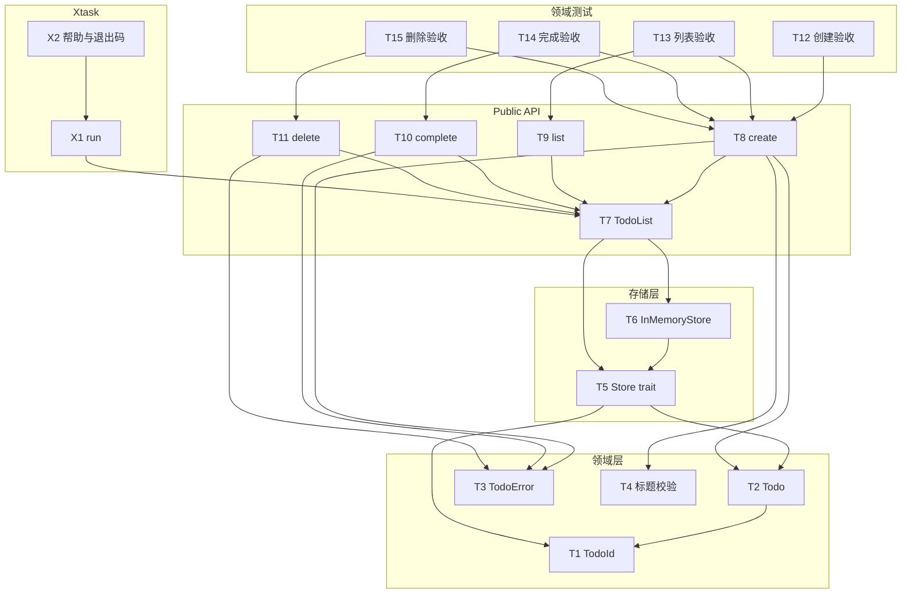

# 任务分解（Tasks）

本文档将 [requirements.md](./requirements.md) 与 [design.md](./design.md) 中的工作映射为可跟踪任务 ID，便于排期、追溯与迭代。**需求章节索引**见 **requirements §9**。

- **状态说明**：**已完成** 表示当前主线已实现并通过测试；**持续** 表示与规格/环境（Lima、β）对齐的长期项；**待对齐** 表示需求已写清、实现需随契约演进。

---

## 1. 与 requirements 章节的对应（总表）

| requirements | 主题 | 任务 ID（见下） |
|--------------|------|-----------------|
| **§1** / **§1.1** | 概述、Mode S/P、会话路径、qcow2/挂载 | **D1–D7**（Devshell / VM） |
| **§3** | Todo 领域 + **`cargo xtask todo`** | **T1–T23**，**X3–X7** |
| **§4** | 其他 **`cargo xtask`**（`run` / `fmt` / `clippy` / …） | **X1–X2** 及 xtask crate 内实现（未逐条编号） |
| **§5** | Devshell（`cargo-devshell`） | **D1–D7** |
| **§6** | **`--json`**、退出码、`init-ai`、**`--dry-run`** | **X8–X11** |
| **§7** | 非功能（Clippy、stderr、TTY、兼容性） | 各 crate **`Cargo.toml`** / CI，未单独任务行 |

---

## 2. 依赖关系概览（领域层，仍适用）

---

## 3. 任务列表

### 3.1 领域层（`crates/todo`）— **已完成**

| ID | 任务 | 依赖 | 产出 / 验收 |
|----|------|------|-------------|
| **T1** | 定义 `TodoId`（`NonZeroU64`） | — | 0 非法；可哈希、可比较 |
| **T2** | 定义 `Todo` | T1 | title、completed、`created_at` / `completed_at`、扩展字段 |
| **T3** | 定义 `TodoError` | — | `InvalidInput`、`NotFound` 等 |
| **T4** | 标题校验 | — | 空标题等返回明确错误 |
| **T5** | `Store` trait | T1, T2 | insert/get/list/update/remove |
| **T6** | `InMemoryStore` | T5 | 默认存储 |
| **T7** | `TodoList<S: Store>` | T5, T6 | 领域门面 |
| **T8** | `create` | T7–T4 | 与 **§3.1** 一致 |
| **T9** | `list` | T7 | 排序与过滤见 T18 |
| **T10** | `complete` | T7, T3 | 含 `completed_at`、`no_next`（T23） |
| **T11** | `delete` | T7, T3 | 与 **§3.1** 一致 |
| **T12–T15** | 领域单元/集成测试 | T8–T11 | 覆盖创建/列表/完成/删除 |

### 3.2 Xtask 工作流（`xtask`）— **已完成**

| ID | 任务 | 依赖 | 产出 / 验收 |
|----|------|------|-------------|
| **X1** | `cargo xtask run` | T7（可选） | 运行约定目标 |
| **X2** | `--help`、基础退出码 | X1 | **§4** |
| **X3** | `cargo xtask todo` + **`.todo.json`** | T7 | **§3.2** |
| **X4** | 列表时间展示、`completed_at` | T10 | **§3.1** 时间 |
| **X5** | TTY 下超 7 天未完成高亮 | X3 | **§3.1** |

### 3.3 扩展（Todo + CLI）— **已完成**

对应 **§3** 扩展能力与 **§6** 可编程接口。

| ID | 任务 | 依赖 | 产出 / 验收 |
|----|------|------|-------------|
| **T16** | `get` / show | T7 | 单条查询 |
| **T17** | `update` / `TodoPatch` | T7, T16 | **§3.2** |
| **T18** | 可选字段、`ListOptions` | T2, T9 | 过滤/排序 **§3.2** |
| **T19** | `search` | T7, T18 | **§3.1** |
| **T20** | `stats` | T7 | **§3.1** |
| **T21** | `export` | T7 | JSON/CSV |
| **T22** | `import` | T7 | 合并 / `--replace` |
| **T23** | `RepeatRule`、`complete(_, no_next)` | T2, T10 | **§3.1** |
| **X6** | CLI：`show` / `update` / `search` / `stats` / `export` / `import` | T16–T22, X3 | **§3.2** |
| **X7** | CLI：`complete --no-next` | T23, X3 | **§3.1** |
| **X8** | 全局 **`--json`** | X3, X6 | **§6** US-A1 |
| **X9** | 退出码 **0/1/2/3** | X3 | **§6** US-A2 |
| **X10** | `todo init-ai` | X3 | **§6** US-A3 |
| **X11** | 修改类 **`--dry-run`** | X3, X6 | **§6** US-A4 |

### 3.4 Devshell / VM（`xtask-todo-lib::devshell`）— **已实现为主，部分持续**

对应 **§1.1**、**§5**、[design.md](./design.md) §1.4、[devshell-vm-gamma.md](./devshell-vm-gamma.md)、[guest-primary-design](./superpowers/specs/2026-03-20-devshell-guest-primary-design.md)。

| ID | 任务 | 状态 | 说明 |
|----|------|------|------|
| **D1** | REPL、**`.dsh`** 脚本、parser、管道、重定向 | 已完成 | **§5.3–§5.5** |
| **D2** | 内存 **VFS**、`cd`/`ls`/文件 builtin | 已完成 | **§5.4** |
| **D3** | **`rustup`/`cargo`** sandbox（导出 → 临时目录 → 同步） | 已完成 | **§5.4**；Linux 可选 mount namespace 见 **dev-container.md** |
| **D4** | γ **Lima** 会话、`push_incremental` / `pull_workspace_to_vfs`、**`DEVSHELL_WORKSPACE_ROOT`** | 已完成 | **§1.1** Mode **S**、[devshell-vm-gamma.md](./devshell-vm-gamma.md) |
| **D5** | **Mode P**：**`GuestFsOps`**、工程树与 guest 挂载一致、**`export-readonly`**（guest 镜像） | 持续 | **§5.1**、**§5.7**；与规格迭代对齐 |
| **D6** | 会话持久化：**`logical_cwd`** 等 → **`$DEVSHELL_WORKSPACE_ROOT/.cargo-devshell/session.json`**（**§1.1**）；无 env 时写入 **`./.cargo-devshell/session.json`**（`current_dir`）；**加载**仍尝试旧版 **`*.session.json`**（与 `.bin` 同目录）以迁移 | 已完成 | `crates/todo/src/devshell/session_store.rs` |
| **D7** | β：**`beta-vm`**、**`devshell-vm`** 侧车、**`guest_fs` IPC** | 可选 / 持续 | **§5.7** |

---

## 4. 用户故事 / 需求条目 → 任务 ID（追溯）

| 需求条目（acceptance / 旧 US 编号） | requirements | 任务 |
|-----------------------------------|--------------|------|
| 创建 / 列表 / 完成 / 删除（核心） | §3.1 | T4, T8–T11, T12–T15 |
| 时间戳与展示 | §3.1 | X4 |
| 长期未完成高亮 | §3.1 | X5 |
| `cargo xtask` / `run` | §4 | X1, X2 |
| `cargo xtask todo` 持久化 | §3.2 | X3 |
| show / update / 可选字段 / 过滤排序 | §3 | T16–T18, X6 |
| search / stats | §3 | T19, T20, X6 |
| export / import | §3 | T21, T22, X6 |
| 重复任务 / `--no-next` | §3 | T23, X7 |
| `--json` / 退出码 / `init-ai` / `--dry-run` | §6 | X8–X11 |
| Mode S/P、VFS、VM、内置语言、会话路径 | §1.1, §5 | D1–D7 |

---

## 5. 建议执行顺序（归档）

历史实施可按下述拓扑分批（当前核心路径**已完成**，仅供回顾或新人理解依赖）：

1. T1, T3, T4 → T2 → T5 → T6 → T7 → T8–T11 → T12–T15  
2. X1, X2 → X4, X3, X5  
3. T16–T23 与 X6–X11（扩展）  
4. Devshell：实现顺序见 **design.md** 与 **superpowers/plans/**（D1–D5 主线；D6–D7 随契约）

---

## 6. 维护

- 新增能力：在 **requirements.md** 落条 → 本表增 ID 或子行 → **test-cases.md** / **acceptance.md** 同步。  
- 文档与实现不一致时，以 [requirements.md](./requirements.md) 与 [design.md](./design.md) 为准，并更新本任务说明。
- **`xtask` 单测**：改动 **`PATH`** 的用例经 **`path_test_lock()`** 串行；改动 **`cwd`** 的经 **`cwd_test_lock()`**；**`git` / `sh`** 相关 pre-commit 用例在宿主无 **`git`** 或 **`sh`** 时提前返回（不失败）。
- **D5 / D7**（Mode P 与 β 侧车）在表中为 **持续 / 可选**：主线能力已接好，后续随 Lima / IPC 契约迭代；非「未实现缺口」。
