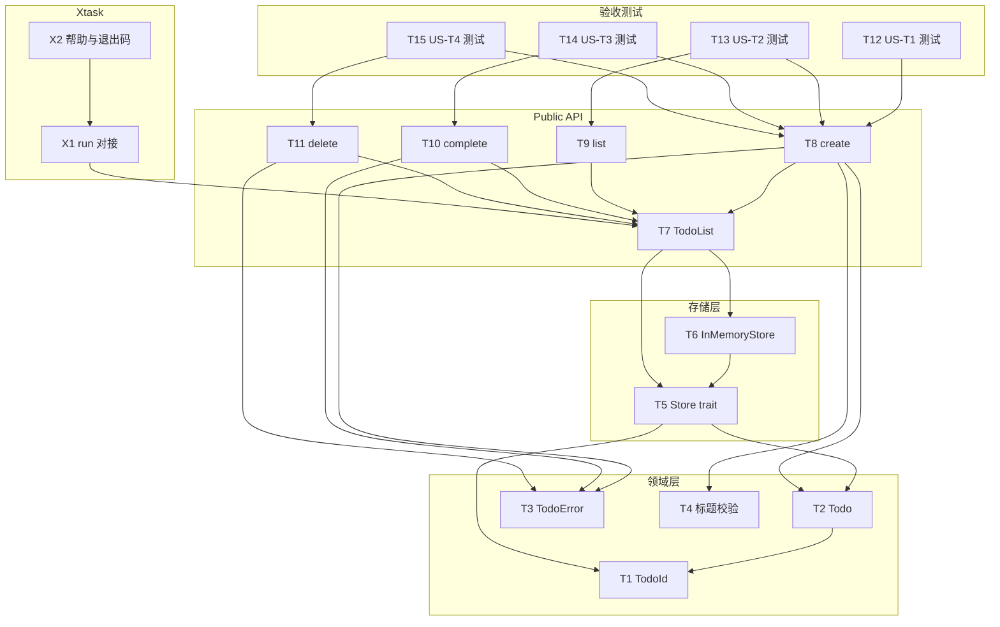

# 任务分解 (Tasks)

本文档将 [requirements.md](./requirements.md) 与 [design.md](./design.md) 中的工作分解为有依赖关系的具体任务，便于排期与跟踪。任务 ID 格式：`Tnn`（Todo 相关）、`Xnn`（Xtask 相关）。

---

## 1. 依赖关系概览

---

## 2. 任务列表

### 2.1 领域层（crates/todo）

| ID | 任务 | 依赖 | 产出 / 验收 |
|----|------|------|-------------|
| **T1** | 定义 `TodoId` 类型 | — | 不透明唯一标识（如 `NonZeroU64` 或 `uuid::Uuid`），实现 `Clone`、`Eq`、`Hash` 等以便作为 key |
| **T2** | 定义 `Todo` 类型 | T1 | 含 `id: TodoId`、`title: String`、`completed: bool`、`created_at`、`completed_at: Option<SystemTime>`；实现必要 trait |
| **T3** | 定义 `TodoError` 枚举 | — | 至少 `InvalidInput`（含原因）、`NotFound(TodoId)`；实现 `std::error::Error` 与 `Display` |
| **T4** | 实现标题校验规则 | — | 函数或方法：空标题（及可选 trim/长度）返回错误原因，供 create 使用（对应 US-T1 非法输入） |

### 2.2 存储层（crates/todo）

| ID | 任务 | 依赖 | 产出 / 验收 |
|----|------|------|-------------|
| **T5** | 定义 `Store` trait | T1, T2 | 方法：`insert(Todo)`、`get(TodoId) -> Option<Todo>`、`list() -> Vec<Todo>`、`update(Todo)`、`remove(TodoId)`；放在内部模块或 crate 内可见 |
| **T6** | 实现 `InMemoryStore` | T5 | 使用 `HashMap<TodoId, Todo>`（或等价结构），实现 `Store`；列表返回时可按 `created_at` 排序 |

### 2.3 Public API（crates/todo）

| ID | 任务 | 依赖 | 产出 / 验收 |
|----|------|------|-------------|
| **T7** | 实现 `TodoList` 门面 | T5, T6 | 持有一个 `dyn Store` 或泛型 `S: Store`，构造时注入（如默认 `InMemoryStore`） |
| **T8** | 实现 `create(&mut self, title)` | T7, T2, T3, T4, T5 | 校验标题（T4）→ 构造 `Todo` → `store.insert` → 返回 `Result<TodoId, TodoError>`（US-T1） |
| **T9** | 实现 `list(&self)` | T7 | 调用 `store.list()`，按创建时间排序后返回 `Vec<Todo>`（US-T2） |
| **T10** | 实现 `complete(&mut self, id)` | T7, T3 | 若存在则更新 `completed = true` 并记录 `completed_at`，否则返回 `TodoError::NotFound`（US-T3、US-T5） |
| **T11** | 实现 `delete(&mut self, id)` | T7, T3 | 若存在则 `store.remove(id)`，否则返回错误或幂等 Ok（US-T4） |

### 2.4 验收测试

| ID | 任务 | 依赖 | 产出 / 验收 |
|----|------|------|-------------|
| **T12** | US-T1 验收测试 | T8 | 有效标题 → 返回 Ok(id)；空标题（及约定非法输入）→ 返回 Err，且列表无新项 |
| **T13** | US-T2 验收测试 | T9, T8 | 空列表 → 返回空 Vec；创建若干条后 list → 顺序按创建时间 |
| **T14** | US-T3 验收测试 | T10, T8 | 存在 id 完成 → 后续 list 中该项 completed=true；不存在 id → Err(NotFound) |
| **T15** | US-T4 验收测试 | T11, T8 | 存在 id 删除 → 后续 list 无该项；不存在 id → 约定行为（Err 或幂等 Ok） |

### 2.5 Xtask 工作流

| ID | 任务 | 依赖 | 产出 / 验收 |
|----|------|------|-------------|
| **X1** | 将 `cargo xtask run` 对接主程序 | T7（可选） | `xtask run` 执行「运行主程序」逻辑（如 `cargo run -p todo` 或占位实现）；失败时 stderr 输出并非 0 退出（US-X2） |
| **X2** | 确认 xtask 帮助与退出码 | X1 | `cargo xtask --help` 列出子命令；`cargo xtask run` 成功 0、失败非 0（US-X1） |
| **X3** | `cargo xtask todo` 子命令 add/list/complete/delete | T7 | 数据持久化到 `.todo.json`；list 展示创建/完成时间与用时（US-X4） |
| **X4** | 时间戳与完成时间（Todo 模型 + list 展示） | T10 | `Todo` 含 `created_at`、`completed_at`；complete 时写入完成时间；list 显示创建/完成/用时（US-T5） |
| **X5** | 长时间未完成高亮（TTY 下 list 着色） | X3 | 创建超过 7 天且未完成项在 TTY 下以不同颜色展示；非 TTY 不输出颜色（US-T6） |

---

## 3. 建议执行顺序

按依赖拓扑排序，可按下述批次实施（同一批内任务可并行）：

1. **第一批（无依赖）**：T1, T3, T4  
2. **第二批**：T2（依赖 T1）  
3. **第三批**：T5（依赖 T1, T2）  
4. **第四批**：T6（依赖 T5）  
5. **第五批**：T7（依赖 T5, T6）  
6. **第六批**：T8, T9, T10, T11（依赖 T7 及前述领域/错误）  
7. **第七批**：T12, T13, T14, T15（依赖对应 API 任务）
8. **第八批**：X1（可选依赖 T7 用于演示），X2（依赖 X1）
9. **第九批**：X4（时间戳与 completed_at），X3（xtask todo 子命令与 .todo.json），X5（TTY 下列表超 7 天未完成项着色）

---

## 4. 与需求/设计的对应

| 需求 | 任务 |
|------|------|
| US-T1 创建待办 | T4, T8, T12 |
| US-T2 列出待办 | T9, T13 |
| US-T3 完成待办 | T10, T14 |
| US-T4 删除待办 | T11, T15 |
| US-X1 cargo xtask 执行 | X1, X2 |
| US-X2 xtask run | X1 |
| US-X3 扩展子命令 | 已在现有 xtask 结构中支持，无需新任务 |
| US-T5 时间戳与完成时间 | X4 |
| US-T6 长时间未完成提醒 | X5 |
| US-X4 cargo xtask todo | X3 |

文档与实现不一致时，以 [requirements.md](./requirements.md) 与 [design.md](./design.md) 为准，并同步更新本任务说明。
